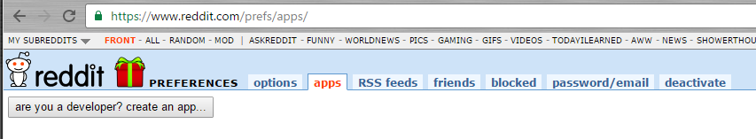
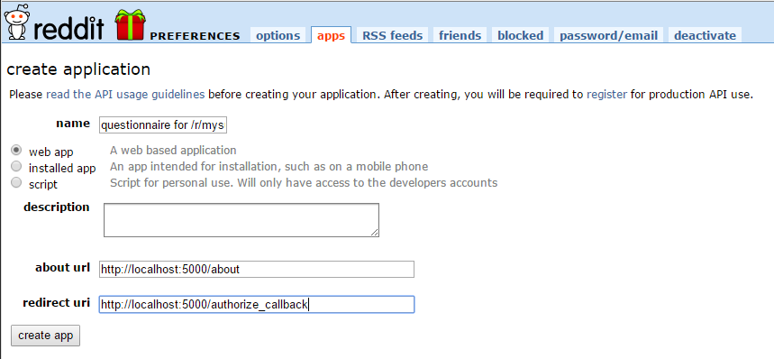
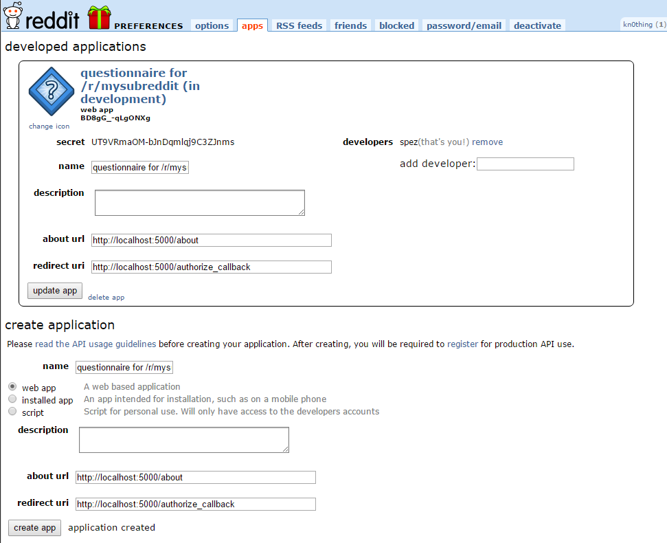
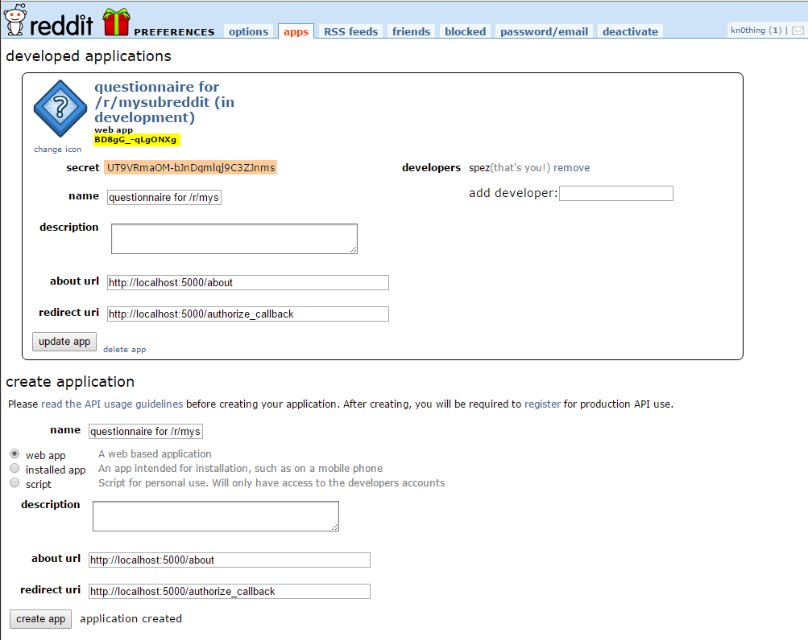

#Questionnaire For Reddit

##Requirements

In order to test this you will need:

* [Python 3.5](https://www.python.org/downloads/release/python-352/). This could probably be made to work with Python 2.7 as well or any Python 3.x, but I prefer Python 3.
* Some PostgreSQL installation. You can use a portable installation as well:
  * The easiest method would be to do a full installation of [PostgreSQL from the official site](https://www.postgresql.org/download/).
  * For Windows or Linux, you can just download the relevant [PostgreSQL binaries](http://www.enterprisedb.com/products-services-training/pgbindownload).  
  * For macOS, you can use [Postgres.app](http://postgresapp.com/) 
* The libraries in requirements.txt
  * **Flask**: The base for the web site
  * **praw**: For interaction with reddit
  * **ruamel.yaml**: For YAML reading (much nicer than PyYAML)
  * **gunicorn**: This is used from heroku as their web server
  * **SQLAlchemy**: For database interaction
  * **pg8000**: Since I'm using a postgres, we need to have a way to connect.
  * **psycopg2**: I only use pg8000, but SQLAlchemy asks for this, too
  * **flask_sqlalchemy**: A way to connect Flask with SQLAlchemy.
   
##Setup

###Reddit application 
Before you start testing, you need to create a reddit application.

1. Head over to [reddit app preferences](https://www.reddit.com/prefs/apps) and click on the "are you a developer? create an app..." (or "create another app...") button.
    1. Put as name whatever you want (e.g. `questionnaire for /r/mysubreddit (in development)`). I put `in development` in there to separate it from when it goes live. 
    2. Leave (*) Web app selected.
    3. Enter whatever you want in the description (or even nothing at all).
    4. You can also leave the **about** field empty. Or put a `http://localhost:5000/about`
    5. The only important part: In the redirect uri put `http://localhost:5000/authorize_callback`
    6. Press the "create app" button
2. Take note of the Client ID and the Client Secret
    1. ClientID is immediately below the "web app" thingie
    2. Secret is the first field below that.

That's it. I probably made it sound harder than it is.

Here's the process in screenshots:

Go to reddit app preferences (step 1 above):  


Fill in the values (step 1.1 through 1.5 above):  


After pressing the "create app button" (step 1.6 above):  


Note the client id (yellow) and the client secret (orange) (step 2 above):  


###Database
Ok, now you just need to create a new database to record any answers. This will only be for development, of course. 
If/when you deploy to heroku, the database will be created from heroku itself.
 
If you have chosen to download the raw binaries (Windows or Linux), you should also run the following batch file 
(just put it on the folder you've unzipped the binaries)

```commandline
@ECHO OFF
REM The script sets environment variables helpful for PostgreSQL
SET PATH="%~dp0\bin";%PATH%
SET PGDATA=%~dp0\data
SET PGDATABASE=postgres
SET PGUSER=postgres
SET PGPORT=5432
SET PGLOCALEDIR=%~dp0\share\locale
REM The line below is only needed the first time you run this
IF NOT EXIST "%PGDATA%" (
    "%~dp0\bin\initdb" -U postgres -A trust
)
"%~dp0\bin\pg_ctl" -D "%~dp0/data" -l logfile start
ECHO Press any key to stop server
PAUSE
"%~dp0\bin\pg_ctl" -D "%~dp0/data" stop
```

or, for Linux
```bash
#!/bin/sh
# The script sets environment variables helpful for PostgreSQL
export PATH=$PATH:`pwd`/bin
export PGDATA=`pwd`/data
export PGDATABASE=postgres
export PGUSER=postgres
export PGPORT=5432
export PGLOCALEDIR=`pwd`/share/locale
echo $PATH
echo $PGDATA
# The line below is only needed the first time you run this
if [ ! -d "$PGDATA" ]; then
    `pwd`/bin/initdb -U postgres -A trust
fi
`pwd`/bin/pg_ctl -D `pwd`/data -l logfile start
read -p "Press [Enter] to stop server." key
`pwd`/bin/pg_ctl -D `pwd`/data stop
```

##Environment variables:

When developing, you need to set up the following environment variables (either at system level, or set them up in a batch file).

* **REDDIT_OAUTH_CLIENT_ID**: Fill that in from the https://www.reddit.com/prefs/apps page
* **REDDIT_OAUTH_CLIENT_SECRET**: Ditto
* **REDDIT_OAUTH_REDIRECT_URL**: While you're doing development, this should be http://localhost:5000/authorize_callback
* **DATABASE_URL**: If you have a local database, this should be something like `postgresql+pg8000://postgres@localhost/questionnaire` 
* **QUESTIONNAIRE_URL**: You can use your official one (for example https://www.reddit.com/r/your_subreddit/wiki/questionnaire.json) or a local file (file:///somewhere/on/your/disk/questionnaire.yml)
* **FLASK_SECRET_KEY**: Any random string (I use `python -c "import base64,os;print(base64.b64encode(os.urandom(48)).decode())"`